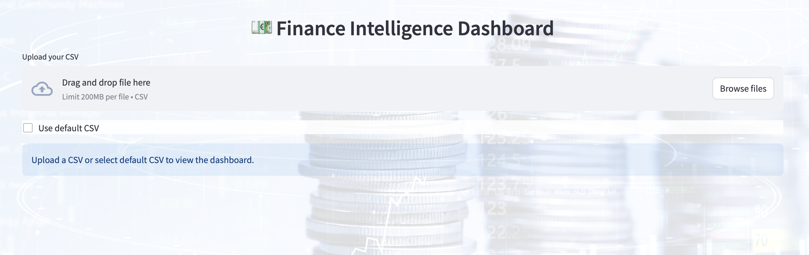
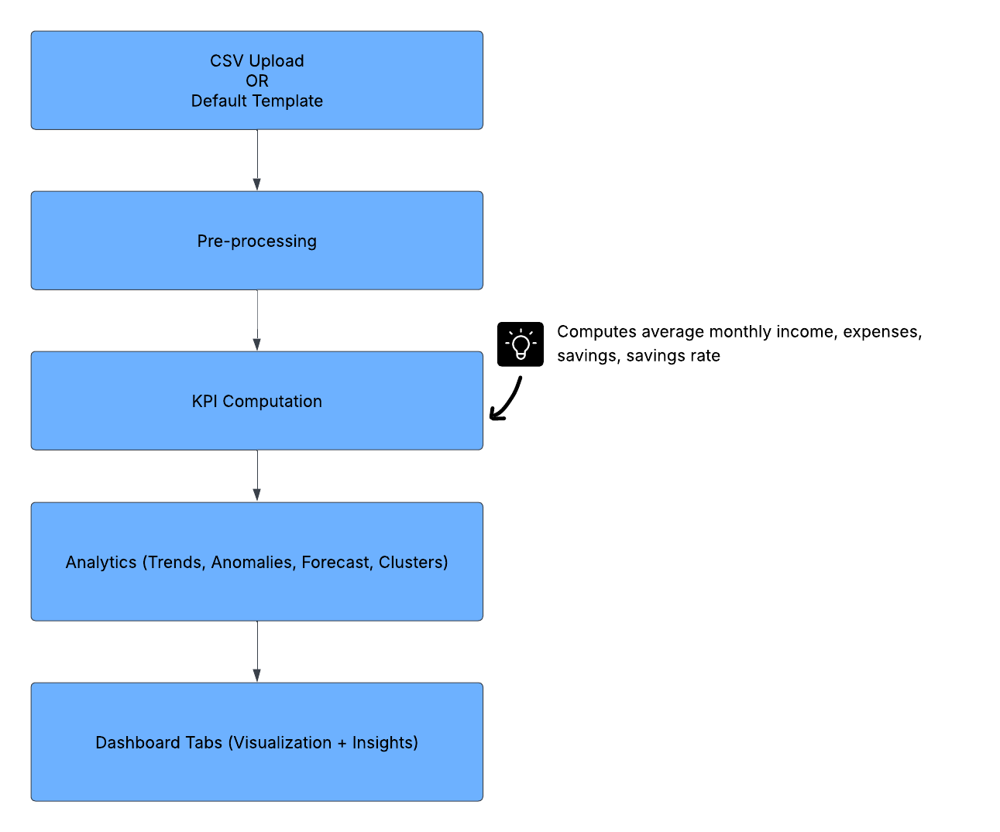
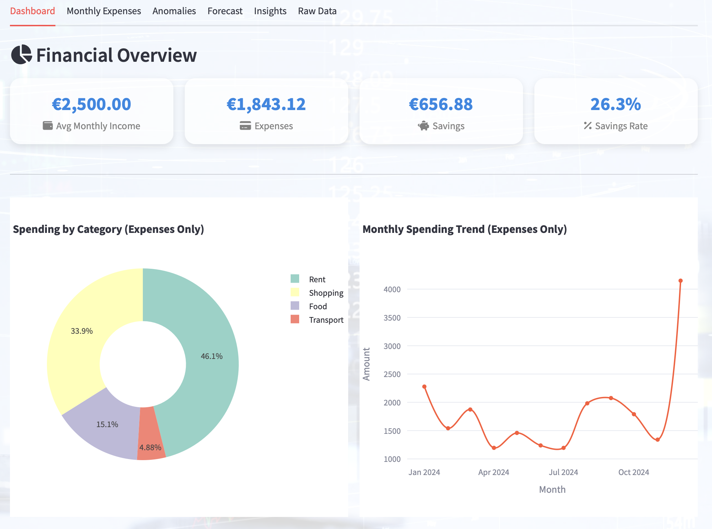
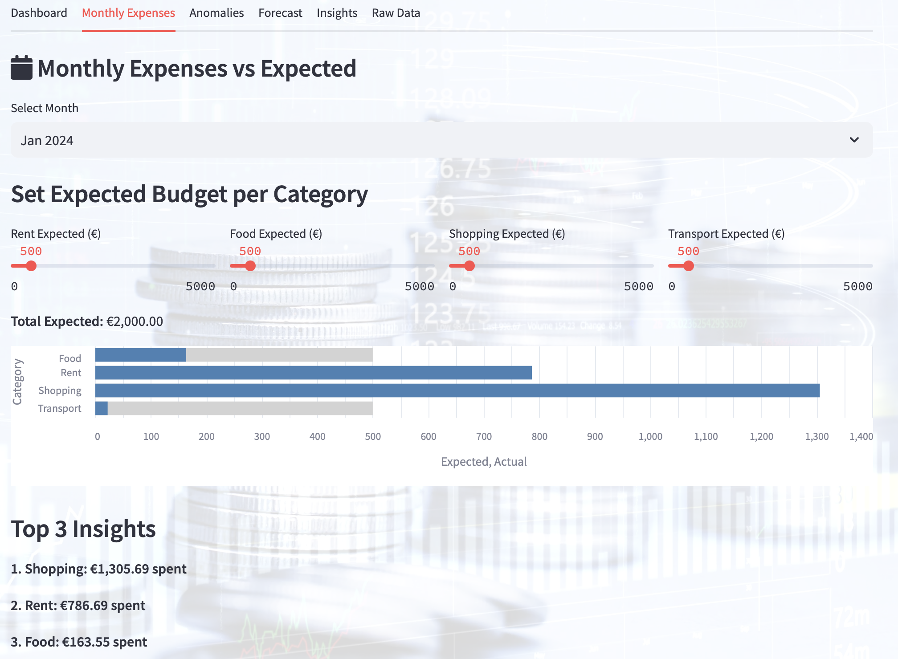
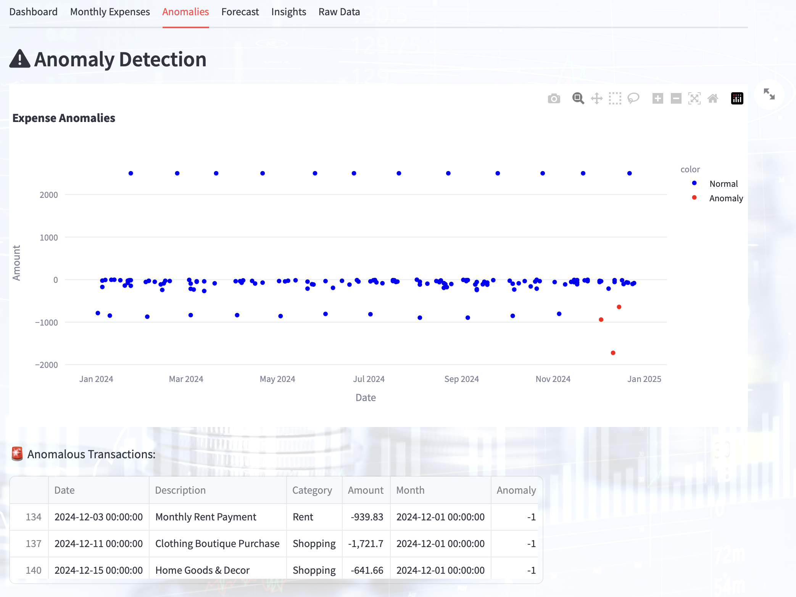
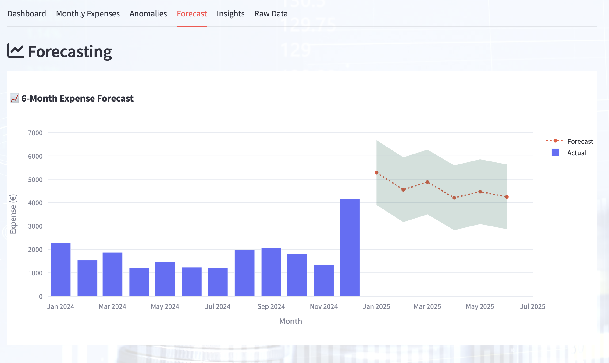
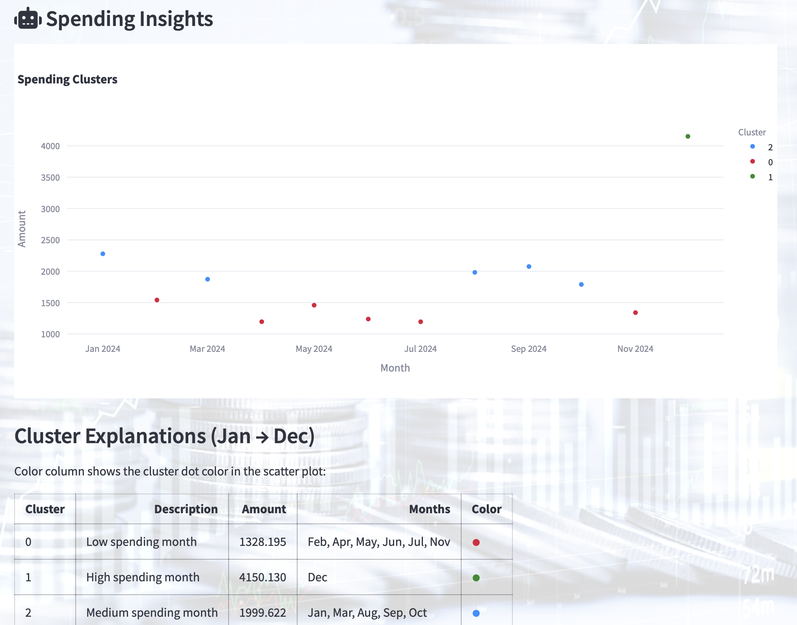
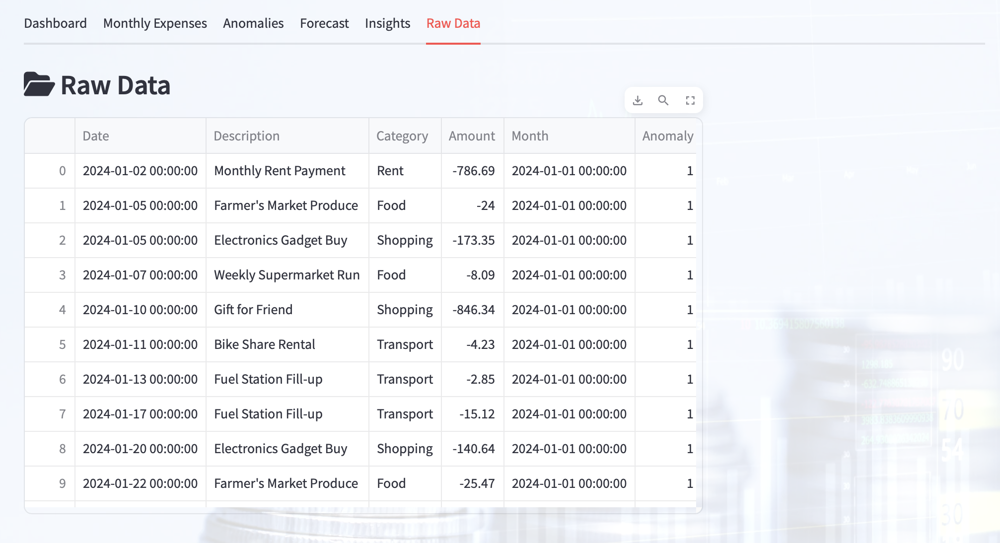

# Finance Intelligence Dashboard
<p align="center">  
    
</p>  

Interactive Streamlit app to visualize personal finances, detect anomalies, forecast expenses, and gain insights.


This project follows a **data → processing → analytics → visualization** pipeline:  

<p align="center">  
    
</p>  

1. **Input** → Upload CSV or use default sample data.  
2. **Preprocessing** → Parse dates, extract months, clean categories.  
3. **KPI Computation** → Income, Expenses, Savings, Savings Rate.  
4. **Analytics Modules** →  
   - Category Spending  
   - Monthly Trends  
   - Anomaly Detection  
   - Forecasting  
   - Spending Clusters  
5. **Visualization** → Interactive dashboard with tabs for overview, insights, and raw data.  
6. **Output** → Personalized financial intelligence insights.  

---

## 🎬 Demo Video

Watch a quick demo of the Finance Intelligence Dashboard in action:  

[▶️ Watch Demo Video](https://drive.google.com/file/d/1sx0gcjufydDJLA7AJP4CgPuwtxy92ci0/view?usp=sharing)


## 📊 Finance Intelligence Dashboard  

Here’s what the dashboard looks like in action, with each tab illustrated:

### 1. Dashboard Tab
<p align="center">
  
</p>
- KPI cards (Income, Expenses, Savings, Savings Rate)  
- Category spending chart  
- Monthly trends chart  

---

### 2. Monthly Expenses Tab
<p align="center">
  
</p>
- Breakdown of monthly spending by category vs income  

---

### 3. Anomalies Tab
<p align="center">
  
</p>
- Highlights unusual transactions or spending patterns  

---

### 4. Forecasting Tab
<p align="center">
  
</p>
- Predicts future expenses  
- Shows forecast trends  

---

### 5. Insights Tab
<p align="center">
  
</p>
- Cluster-based analysis of spending behavior  
- Labels months as Low / Medium / High spending  

---

### 6. Raw Data Tab
<p align="center">
  
</p>
- Interactive table view of all uploaded transactions  

  
## Requirements

To install requirements:

```setup
pip install -r requirements.txt
```
##  Installation & Setup  

Clone the repository and install the required dependencies:  

```bash
git clone https://github.com/nandanasreeraj123/finance-dashboard.git
cd finance-dashboard

# install dependencies
pip install -r requirements.txt

# run the app
streamlit run app.py
```
## 📂 Sample Data  

A sample dataset (`Sample_data/sample_data.csv`) is included so you can explore the dashboard without using your personal bank data.  

### 📋 Schema  

| Column       | Type        | Description                                                                 |
|--------------|------------|-----------------------------------------------------------------------------|
| `Date`       | Date (YYYY-MM-DD) | The date of the transaction.                                            |
| `Description`| Text        | A short note describing the transaction (e.g., *Monthly Rent Payment*).    |
| `Category`   | Categorical | The spending or income category (e.g., *Food, Rent, Transport, Salary*).   |
| `Amount`     | Numeric (€) | Transaction amount: **positive = income (e.g., Salary), negative = expense (e.g., Rent, Food, Shopping, Transport).** |

### 📊 Example  

```csv
Date,Description,Category,Amount
2024-01-02,Monthly Rent Payment,Rent,-786.69
2024-01-05,Farmer's Market Produce,Food,-24.00
2024-01-10,Gift for Friend,Shopping,-846.34
2024-01-24,Monthly Salary,Salary,2500.00
```

## 📋 CSV Preparation Checklist  

To make sure your CSV file loads correctly in the dashboard:  

1. Column names must be exactly: **`Date`**, **`Description`**, **`Category`**, **`Amount`**  
   *(as expected by the code).*  
2. `Date` should be in ISO format **`YYYY-MM-DD`** (or any format parseable by `pandas.to_datetime`).  
3. `Amount` must be numeric and use a `.` decimal (no currency symbols).  
   - ✅ Example: `-786.69`, `2500.00`  
   - ❌ Avoid: `$786.69`, `2,500`  
4. Positive values = **Income** (e.g., Salary).  
5. Negative values = **Expenses** (e.g., Rent, Food, Shopping).  
6. If you have multiple currencies, convert them into a single currency before loading.

## 📋 Quick Start with Default CSV

You can explore the Finance Intelligence Dashboard immediately **without uploading your own CSV** using the **Use default CSV** checkbox on the home page.

